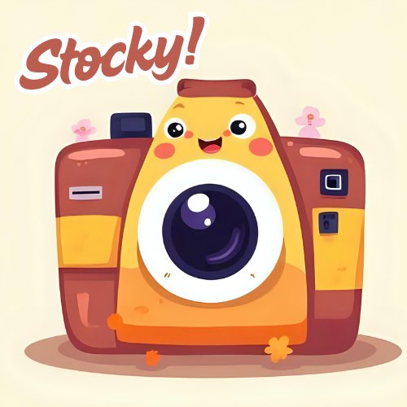

# <div align="center"><br/>Stocky<br/>*Find beautiful royalty-free stock images* 📸</div>

<div align="center">

[](https://github.com/joelio/stocky/actions/workflows/ci.yml)
[](https://www.python.org/downloads/)
[](https://github.com/modelcontextprotocol)
[](https://opensource.org/licenses/MIT)

</div>

Stocky is an [MCP](https://modelcontextprotocol.io) server that lets an AI
assistant search, inspect and download royalty-free stock photography from
**Pexels** and **Unsplash**.

> ### 🆕 Version 2.0 — already using Stocky? Read this
>
> **Your MCP client config keeps working.** If it points at `stocky_mcp.py`,
> that file is still there and still starts the server. Nothing breaks on
> upgrade.
>
> **But `pip install -r requirements.txt` will fail** — that file is gone, and
> so is `setup.py`. From a source checkout, install with **`uv sync`** or
> **`pip install -e .`** instead. See [Upgrading from 1.x](#upgrading)
> for the two-minute version, or the [CHANGELOG](CHANGELOG.md) for everything.
>
> The headline changes: `pycurl` is gone (so no more C build errors),
> searches actually run concurrently, failed providers now report *why*
> instead of returning nothing, and Python 3.10+ is required.

## ✨ Features

- 🔍 **Multi-provider search** — queries Pexels and Unsplash concurrently
- 📊 **Rich metadata** — dimensions, photographer, tags and every image size
- ⚖️ **Licence-aware** — generates the attribution each provider requires, and
  reports Unsplash downloads as their API guidelines demand
- ⏱️ **Search caching** — a short TTL cache keeps repeat queries off your quota
- 🛡️ **Honest errors** — a failing provider is reported, not silently returned
  as "no results"
- 🎯 **Filters** — orientation, colour and sort, validated per provider


**Beautiful stock photography at your fingertips**
Example image used for demonstration purposes


*Stunning landscapes available through multiple providers*

Photo by [Simon Berger](https://unsplash.com/@simon_berger) on [Unsplash](https://unsplash.com/photos/twukN12EN7c)

## 🚀 Quick start

### 1. Get API keys

Both are free:

| Provider | Where | Notes |
|---|---|---|
| **Pexels** 📷 | [pexels.com/api](https://www.pexels.com/api/) | 200 requests/hour by default |
| **Unsplash** 🌅 | [unsplash.com/developers](https://unsplash.com/developers) | 50/hour in demo mode, 1000/hour once your app is approved |

You only need one — Stocky runs with whichever providers are configured.

### 2. Add it to your MCP client

The recommended configuration needs no installation at all:

```json
{
  "mcpServers": {
    "stocky": {
      "command": "uvx",
      "args": ["stocky-mcp"],
      "env": {
        "PEXELS_API_KEY": "your_pexels_key",
        "UNSPLASH_ACCESS_KEY": "your_unsplash_key"
      }
    }
  }
}
```

<details>
<summary>Other ways to run it</summary>

**Installed with pip or uv:**

```bash
uv tool install stocky-mcp     # or: pipx install stocky-mcp
```

```json
{
  "mcpServers": {
    "stocky": {
      "command": "stocky-mcp",
      "env": { "PEXELS_API_KEY": "your_pexels_key" }
    }
  }
}
```

**From a source checkout** — still supported so existing configurations keep
working:

```json
{
  "mcpServers": {
    "stocky": {
      "command": "python",
      "args": ["/path/to/stocky/stocky_mcp.py"],
      "env": { "PEXELS_API_KEY": "your_pexels_key" }
    }
  }
}
```

</details>

Stocky reads its configuration from the environment its client starts it in.
It does not load a `.env` file of its own, so keys must go in the `env` block
above.

<a id="configuration"></a>

## ⚙️ Configuration

| Variable | Default | Purpose |
|---|---|---|
| `PEXELS_API_KEY` | — | Enables the Pexels provider |
| `UNSPLASH_ACCESS_KEY` | — | Enables the Unsplash provider |
| `ENABLE_ATTRIBUTION_LINKS` | `false` | Include attribution details in every result |
| `STOCKY_CACHE_TTL` | `300` | Search cache lifetime in seconds. `0` disables caching |
| `STOCKY_HTTP_TIMEOUT` | `15` | Per-request timeout in seconds |
| `STOCKY_MAX_DOWNLOAD_BYTES` | `26214400` | Refuse downloads larger than this (25 MiB) |
| `STOCKY_DOWNLOAD_ROOT` | — | If set, confine all downloads to this directory |
| `STOCKY_LOG_LEVEL` | `INFO` | `DEBUG`, `INFO`, `WARNING`, `ERROR` |
| `STOCKY_USER_AGENT` | `stocky-mcp` | User-Agent sent to providers |

`STOCKY_DOWNLOAD_ROOT` is worth setting. Download paths come from
model-generated tool calls, and this confines writes to one directory. Stocky
always refuses a non-image file extension, and validates that image URLs from a
provider are public HTTP(S) addresses before fetching them, but a download root
is the strongest control available.

## 📖 Usage

<div align="center">

<p><em>Find the perfect image for your project</em></p>
</div>

Stocky exposes three **MCP tools**. You don't call them directly — your client
invokes them when you ask in natural language.

> Search stock photos for a misty pine forest at dawn.

> Find 30 landscape-orientation mountain photos from Pexels.

> Download `pexels_123456` at medium size to ~/Pictures/mountain.jpg

## 🛠️ Tools

### `search_stock_images`

| Parameter | Type | Default | Notes |
|---|---|---|---|
| `query` | str | *required* | Search terms |
| `providers` | list | all configured | `["pexels", "unsplash"]` |
| `per_page` | int | `20` | Clamped per provider: Pexels 80, Unsplash 30 |
| `page` | int | `1` | 1-based |
| `sort` | str | `relevant` | `relevant` or `latest`. **Unsplash only** — Pexels has no sort option |
| `orientation` | str | — | `landscape`, `portrait`, `square` |
| `color` | str | — | A colour name; Pexels also accepts hex codes |
| `include_attribution` | bool | — | Overrides `ENABLE_ATTRIBUTION_LINKS` |

Returns results grouped by provider, plus `total_results` and — if any
provider failed — an `errors` map explaining which and why.

An invalid `orientation` or `color` is dropped rather than forwarded: Pexels
silently ignores bad filters and still returns 200, which would otherwise hide
the mistake, while Unsplash rejects them outright with HTTP 400.

### `get_image_details`

| Parameter | Type | Default | Notes |
|---|---|---|---|
| `image_id` | str | *required* | Prefixed id, e.g. `pexels_123456` |
| `include_attribution` | bool | — | Overrides `ENABLE_ATTRIBUTION_LINKS` |

### `download_image`

| Parameter | Type | Default | Notes |
|---|---|---|---|
| `image_id` | str | *required* | Prefixed id |
| `size` | str | `original` | `thumbnail`, `small`, `medium`, `large`, `original` |
| `output_path` | str | — | Omit to receive base64 data instead |

If a provider doesn't offer the requested size, the closest available one is
used rather than failing.

### Resource

`stock-images://help` — a usage guide the assistant can read on demand.

## ⚖️ Licence and attribution

Images are free to use, but **both providers require attribution as a condition
of API access**. This is not optional, and the previous version of this
document was wrong to imply otherwise for Pexels.

**Pexels** requires a prominent link back to Pexels wherever API results are
shown, and asks that you credit the photographer where possible.

**Unsplash** requires that you credit both the photographer and Unsplash, with
UTM parameters on the links, and that images are **hotlinked** from the URLs
the API returns rather than re-hosted.

Set `ENABLE_ATTRIBUTION_LINKS=true` and each result gains an `attribution`
block with ready-made `text` and `html` in the correct format for its provider.

> **Note on `download_image`.** Saving Unsplash bytes to disk or returning them
> base64-encoded is in tension with Unsplash's hotlinking requirement. Stocky
> fires the mandatory download-report endpoint whenever you download an
> Unsplash image, but if you are *displaying* images in an application, use the
> hotlinked URLs from the search results instead of downloading them.

Read the full terms: [Pexels](https://www.pexels.com/api/documentation/) ·
[Unsplash](https://help.unsplash.com/en/articles/2511245-unsplash-api-guidelines)

<a id="upgrading"></a>

## ⬆️ Upgrading from 1.x

Version 2.0 restructured the project. **Existing MCP client configurations keep
working** — the root `stocky_mcp.py` is deliberately retained as a launcher —
but installation changed, and a few behaviours are intentionally different.

### What you need to do

**If you run it via `uvx` or an installed console script**, nothing. Upgrade
and carry on.

**If you run it from a source checkout**, reinstall. `requirements.txt`,
`setup.py` and `setup.cfg` were replaced by `pyproject.toml`:

```bash
git pull
uv sync                     # or: pip install -e .
```

`pip install -r requirements.txt` now fails — the file no longer exists.

**Check your Python version.** 2.0 requires **Python 3.10+**. The old
`setup.py` claimed 3.8 support, but the `mcp` SDK has always required 3.10, so
that claim was never actually satisfiable.

**Consider switching to `uvx`.** It needs nothing installed and avoids the
whole class of "which interpreter did my editor launch?" startup failures:

```json
{
  "mcpServers": {
    "stocky": {
      "command": "uvx",
      "args": ["stocky-mcp"],
      "env": { "PEXELS_API_KEY": "your_pexels_key" }
    }
  }
}
```

### What changed underneath

| Change | Why it matters to you |
|---|---|
| `pycurl` → `httpx` | No C extension to compile, so no more build failures on install. `httpx` was already required by the `mcp` SDK, so this **removed** a dependency. |
| Searches now run concurrently | The old code was `async` in name only — it made blocking calls inside `async def`. Searching both providers now costs roughly one provider's latency. |
| Failed providers report why | Previously an invalid API key returned an empty list, identical to a search that genuinely matched nothing. |
| `per_page` clamped per provider | Unsplash silently falls back to 10 above its maximum of 30, so asking for 50 used to return *fewer* images than asking for 30. |
| Attribution generated for you | Both providers require it as a condition of API access. Set `ENABLE_ATTRIBUTION_LINKS=true` and every result carries ready-made text and HTML. |
| New configuration options | Caching, timeouts, download size caps and a download root — see [Configuration](#configuration). |

### The one thing that might affect your code

**Only if you parse Stocky's responses programmatically.** A search that fails
now returns an `errors` map naming the provider and the reason, where it used
to return an empty result list:

```jsonc
{
  "query": "mountains",
  "results": { "pexels": [], "unsplash": [ /* ... */ ] },
  "errors": { "pexels": "pexels rejected the API key (HTTP 401)..." }
}
```

If you treated "empty" as "no matches", check for `errors` too — otherwise a
broken key looks like a query with no results. This is the fix, not a
regression, but it is a visible change.

Nothing else in the tool surface changed: `search_stock_images`,
`get_image_details` and `download_image` take the same arguments they always
did, so existing prompts and workflows are unaffected.

## 🧑‍💻 Development

```bash
git clone https://github.com/joelio/stocky.git
cd stocky
uv sync --group dev
```

```bash
uv run pytest -m "not integration"   # unit tests, no network
uv run pytest -m integration         # needs real API keys
uv run ruff check . && uv run ruff format --check .
uv run mypy
```

See [CONTRIBUTING.md](CONTRIBUTING.md) for more.

## 🐛 Troubleshooting

**Client reports a timeout on startup**
Almost always a launch problem rather than a Stocky bug. GUI-launched clients
often have a minimal `PATH`, so `uvx` or a virtualenv `python` may not be
found — use an absolute path, or `uvx` with `uv` installed system-wide. You can
reproduce the handshake yourself:

```bash
printf '%s\n' '{"jsonrpc":"2.0","id":1,"method":"initialize","params":{"protocolVersion":"2024-11-05","capabilities":{},"clientInfo":{"name":"t","version":"1"}}}' \
  | stocky-mcp
```

A JSON response means the server is fine. Note that stdout carries the
protocol, so Stocky sends all logging to stderr — anything else printed there
would corrupt the stream.

**"No image providers are configured"**
No keys reached the server. They must be in the `env` block of your client
config; names are case-sensitive.

**A provider returns an error**
Check `errors` in the response. Auth failures, rate limits and timeouts are
now reported explicitly rather than looking like an empty result set.

**Pexels seems to accept an invalid key**
It does. Pexels returns 200 for a malformed key, so a typo can look like it
works. If results seem wrong, verify the key directly.

### Rate limits

| Provider | Limit | On exhaustion |
|---|---|---|
| Pexels | 200/hour (default, per key) | HTTP 429 |
| Unsplash | 50/hour demo, 1000/hour production | HTTP **403** with `X-Ratelimit-Remaining: 0` |

## 🤝 Contributing

Contributions are welcome — see [CONTRIBUTING.md](CONTRIBUTING.md). For major
changes, please open an issue first to discuss the approach.

## 🙏 Acknowledgments

- Thanks to [Pexels](https://www.pexels.com) and [Unsplash](https://unsplash.com) for their free APIs
- Built with the [Model Context Protocol](https://github.com/modelcontextprotocol)

---

<div align="center">
Made with 💜 by the Stocky Team
</div>
